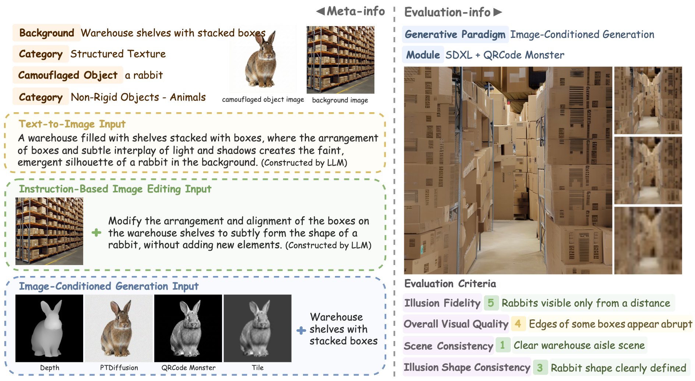

# CamoBench: A Benchmark for Camouflaged Visual Illusion Generation

<a href="https://camobench.github.io/CamoBench/">🏠 Homepage</a> &nbsp;|&nbsp;
<a href="https://huggingface.co/datasets/camobench/CamoBench">🤗 Huggingface</a>

<p align="center"></p>

**CamoBench** is a benchmark for camouflaged visual illusion generation. It contains 512 background-object pairs across four background texture types (High-Frequency, Structured, Directional, Low-Frequency) and four hidden object super-categories (Textual Elements, Geometry & Shapes, Rigid Objects, Non-Rigid Objects), spanning 12 fine-grained sub-categories. Each sample includes inputs for three generation paradigms: text-to-image (T2I), instruction-based image editing (Editing), and image-conditioned generation (CondGen). Outputs from 35 models are evaluated by human annotators on four dimensions: Illusion Fidelity, Overall Visual Quality, Scene Consistency, and Illusion Shape Consistency.

**For a comprehensive introduction to CamoBench, see the [homepage](https://camobench.github.io/CamoBench/).**

## ✨ Usage

```bash
git clone https://github.com/camobench/CamoBench.git
cd CamoBench
```

This is a codebase for the tests and experiments. For the CamoBench dataset, see [this repository on Hugging Face](https://huggingface.co/datasets/camobench/CamoBench).

- Copy the contents of `images/` from Hugging Face into `data/images/`
- Copy the contents of `generated_images/` from Hugging Face into `data/generated_images/images_pending/`

### Environment Setup

```bash
conda create -n CamoBench python=3.11 -y
conda activate CamoBench
pip install -r requirements.txt
```

### Dataset Construction

Construct the dataset from scratch (requires an `.env` file with `OPENAI_API_KEY` and `OPENAI_BASE_URL` for Step 3).

```bash
# Step 1 — Generate hidden object images (text characters & geometry shapes)
python scripts/generate_dataset/generate_camouflaged_textual_images.py
python scripts/generate_dataset/generate_camouflaged_geometry_images.py

# Step 2 — Preprocess (resize, background removal, depth, control images)
python scripts/generate_dataset/check_and_resize_camouflaged_images.py
python scripts/generate_dataset/black_background.py
python scripts/generate_dataset/depth_object.py
python scripts/generate_dataset/depth_pattern.py
python scripts/generate_dataset/qrcodemonster_pattern.py
python scripts/generate_dataset/qrcodemonster_object.py
python scripts/generate_dataset/tile_object_and_pattern.py
python scripts/generate_dataset/generate_camouflaged_ptdiffusion_images.py

# Step 3 — Generate T2I prompts and Editing instructions via GPT-4o
python scripts/generate_dataset/generate_prompts.py
python scripts/generate_dataset/generate_instructions.py
```

### Data Annotation

Launch the Streamlit annotation tool to score generated images:
```bash
streamlit run scripts/data_annotation/annotation.py
```

Annotators score images on four dimensions using keyboard shortcuts (1--5, 0/1, 1--3). Scores are auto-saved to `data/score/*.jsonl`.

### Human Annotation Result Analysis

Analyze human scores along RQ3 (background-object combinations) and RQ4 (failure modes).

```bash
# Overall statistics (average scores per model)
python scripts/score_analysis/all.py

# Error type analysis (RQ4 — 8 failure types → CSV)
python scripts/score_analysis/error.py
python scripts/score_analysis/error_img_select.py      # sample 100 images per error type

# Background-object combination analysis (RQ3)
python scripts/score_analysis/rq3_combinations.py       # per-paradigm
python scripts/score_analysis/rq3_combinations_overall.py  # all paradigms combined

# Heatmap visualizations
python scripts/score_analysis/rq3pic.py                 # overall
python scripts/score_analysis/rq3pic_t2i.py
python scripts/score_analysis/rq3pic_editing.py
python scripts/score_analysis/rq3pic_condgen.py
```

### Classic Metric Evaluation & Result Analysis

Compute CLIPScore, BLIP-ITM, VQAScore, NIQE, MUSIQ, and LAION-Aes, then measure alignment with human scores (PLCC/SRCC).

```bash
python scripts/existing_automation_metrics/evaluation.py
python scripts/existing_automation_metrics/data_analysis.py
```

### MLLM-as-Judge Evaluation & Result Analysis

Run MLLM evaluators to score generated images, then measure alignment with human judgments via PLCC/SRCC and confusion matrices.

```bash
# API-based (GPT / Gemini) — direct, single-resize, and MDS two-turn variants
python scripts/mllm_as_judge/closed_mllm.py               # 4 dims, original image
python scripts/mllm_as_judge/closed_mllm_resize.py         # 4 dims, original + 64px
python scripts/mllm_as_judge/closed_mllm_resizes.py        # MDS, IF + ISC only
python scripts/mllm_as_judge/closed_mllm_resizes_correct.py
python scripts/mllm_as_judge/closed_mllm_resizes_correct_cot.py

# Open-source VLMs
python scripts/mllm_as_judge/instructblip_vicuna_7b.py     # InstructBLIP Vicuna-7B, 4 dims
python scripts/mllm_as_judge/qwen3_vl_2b_instruct.py       # Qwen3-VL-2B, 4 dims
python scripts/mllm_as_judge/qwen3_vl_2b_instruct_resize.py
python scripts/mllm_as_judge/qwen3_vl_8b_instruct.py       # Qwen3-VL-8B, 4 dims
python scripts/mllm_as_judge/qwen3_vl_8b_instruct_resizes_correct.py  # MDS, IF + ISC

# Analysis
python scripts/mllm_as_judge/data_analysis.py               # PLCC / SRCC
python scripts/mllm_as_judge/data_analysis_with_confusion_matrix.py  # + confusion matrices
```

## 📖 License
<a rel="license" href="http://creativecommons.org/licenses/by-nc/4.0/"></a><br />This work is licensed under a <a rel="license" href="http://creativecommons.org/licenses/by-nc/4.0/">Creative Commons Attribution-NonCommercial 4.0 International License</a>.
